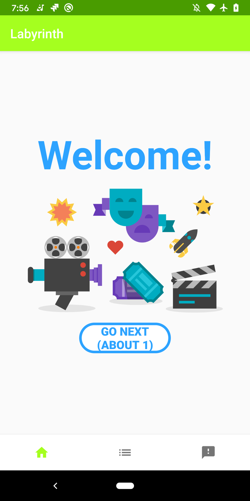
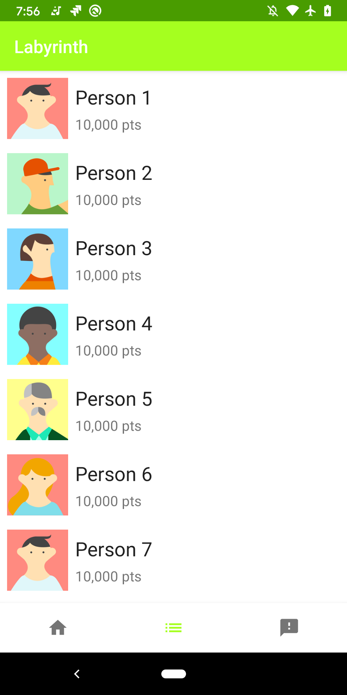
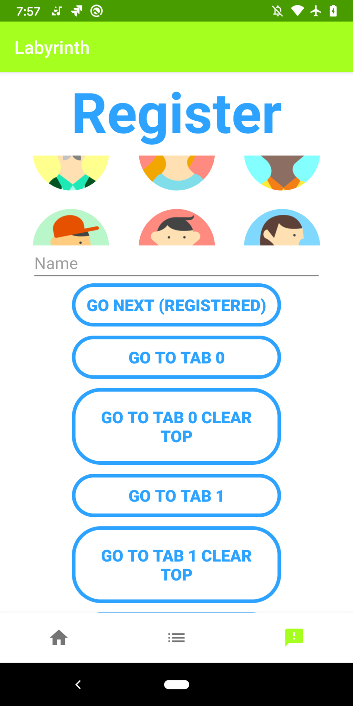

Labyrinth
=========

A multi back stack android navigation

MIT License - Copyright (c) 2020 Abanoub Milad Nassief Hanna\
abanoubcs@gmail.com\
[@Linkedin](https://www.linkedin.com/in/abanoubmilad/)\
[@Github](https://github.com/abanoubmilad)


<p align="center">
  
</p>


Screen shots
==========

<p align="center">
  
  
  
</p>


How to add
==========

Add to project level `build.gradle`

```Groovy

allprojects {
    repositories {

        maven { url "https://jitpack.io" }
        
    }
}
```

Add to app level `build.gradle`

```Groovy
    dependencies {

        implementation 'com.github.abanoubmilad:labyrinth:0.3'
        
    }
```

How to use
==========

```kotlin
class ExampleMultiNavActivity : AppCompatActivity(), INavHolder {

    lateinit var labyrinth: Labyrinth
    override fun getINav() = labyrinth

    override fun onCreate(savedInstanceState: Bundle?) {
        super.onCreate(savedInstanceState)
        setContentView(R.layout.example_multi_nav_activity)

        labyrinth = Builder(
            viewModelStoreOwner = this,
            lifecycleOwner = this,
            fragmentManager = supportFragmentManager,

        /*
        *   @ResId of FragmentContainerView that exists in your layout
        *   type: androidx.fragment.app.FragmentContainerView 
        */
            fragmentContainerId = R.id.nav_host_container, 
            
        /*
        *   BottomNavigationView that exists in your layout
        *   type: com.google.android.material.bottomnavigation.BottomNavigationView
        */
            bottomNavigationView = bottom_nav,

        /*
        *   list of lazy fragment initializer where each initializer 
        *   represents the back stack root fragment
        */
            rootTabFragmentsInitializer = listOf(
                { Welcome() },
                { Leaderboard() },
                { Register() }
            ),
            
        /*
        *   map of each menu item id to it's corresponding stack index
        *   if a menu item should not map to a stack do not pass it
        *
        *   if a menu ResId maps to a stack index, once clicked by user
        *   the module will navigate to the corresponding stack and display it
        *   onNavTabSelected callback will be fired
        * 
        *   if a menu ResId does not map to a stack index, once clicked by user
        *   onNonNavTabSelected callback will be fired
        */
            menuItemIdToRootTabFragmentIndexMap = hashMapOf(
                R.id.home to 0,
                R.id.list to 1,
                R.id.form to 2

            )).apply {
         
        /*
        *   OPTIONAL CUSTOMIZATIONS
        */
        
        
        /*
        *   initial selected tab
        */
            defaultSelectedTabIndex  = 0
    
        /*
        *   if enabled, clicking same tab wil reset the current stack to its root fragment
        *   else, clicking same tab will behave as clicking back i.e pop current stack
        */
            resetOnSameTabClickEnabled = true
        
        /*
        *   if enabled, the fragments will survive any configuration change
        *   i.e fragments will be maintained even if activity is recreated
        *   this functionality is achieve using a view model
        */
            saveStateEnabled  = false
        
        /*
        *   fragments pushed into current tab
        *   will be retained as long as their current tab is the selected one (active tab)
        * 
        *   when tab is switched you can choose to keep the non active stack fragments in memory
        *   so that when you switch back you will get the same instances
        *   OR destroy the non active stack fragments and recreate them (with same bundle) when their tab is selected again
        * 
        *   if enabled, non active tab (any tab that is not selected) fragments will be retained in memory
        *   if disabled, non active tab fragments will be destroyed and recreated 
        *   with their previous bundle when the tab is selected again
        *   
        *   For better performance it's suggested to keep this disabled
        *   so fragments of other tab can be destroyed and release memory resources
        * 
        */
            retainNonActiveTabFragmentsEnabled = false
    
        /*
        *   if enabled, tabs history will be maintained
        */
            tabHistoryEnabled = true
    
        /*
        *   onNavTabSelected: ((menItemId: Int) -> Unit)?
        *   a callback fired when a bottom menu tab is clicked (nav tab)
        *   i.e when a bottom menu tab that corresponds to a back stack is clicked
        *   
        *   a bottom menu tab corresponds to a stack if 
        *   its exists in the menuItemIdToRootTabFragmentIndexMap
        * 
        */
            onNavTabSelected = null
         
        /*
        *   onNonNavTabSelected: ((menItemId: Int) -> Unit)?
        *   a callback fired when a bottom menu tab is clicked (non nav tab)
        *   i.e when a bottom menu tab that does not correspond to a back stack is clicked
        *   
        *   a bottom menu tab does not correspond to a stack if 
        *   its id does exist in the menuItemIdToRootTabFragmentIndexMap
        * 
        */
            onNonNavTabSelected = null

        }.build()
    }


    override fun onDestroy() {
        /*
        *   labyrinth should release it's resources
        */
        labyrinth.onDestroy()
        super.onDestroy()
    }

    override fun onBackPressed() {
        /*
        *   if shouldCallSuperOnBackPressed is true it means that labyrinth
        *   can not move any more back i.e both back stack and tabs history are empty
        */
        if (labyrinth.shouldCallSuperOnBackPressed())
            super.onBackPressed()
    }

}

```    

```kotlin
 /*
  *
  *  Note: using a fragment that does not extend NavFragment will also work
  *  but then you wont have the onVisible() callback since the fragment view wont be retained
  *  i.e it will behave same as setting shouldSaveState = false
  *  where the view will be created each time
  *  (but of course you will still have the multi stack behaviour as expected)
  * 
  */
class About1 : NavFragment() {   
    /*
    *   open val shouldSaveState = false
    * 
    *   if set to true:
    * 
    *       the fragment will retain its view 
    *       (leak canary will complain about this as a leak, but it's a false positive one)
    *       i.e the view will survive back stack operations unless the fragment itself is dismissed
    *   
    *       in this case:
    *           
    *           buildRootView() is guaranteed to be called once only
    *           onCreated() is guaranteed to be called once only
    *           this callback is suitable for doing your view initializations
    * 
    *           onVisible() called is guaranteed to be called at least once
    *           as it will be called each time the fragment becomes visible again on ui
    *           if you use view model, you need to observe the view model inside the
    *           the onVisible() not the onCreated()
    * 
    *      example:      
    *      fragment A is added to backs tack -> A.buildRootView() ->  A.onCreated()->  A.onVisible() -> fragment B 
    *      is added on top of A -> .... fragment B is dismissed -> A.onVisible() -> .......
    *  
    *   if set to false:
    * 
    *       the fragment will not retain its view
    *       i.e the view will be destroyed during the back stack operations
    *   
    *       in this case:
    * 
    *           buildRootView(), onCreated() and onVisible() 
    *           will be called in order, each time the fragment becomes visible on ui
    *           whether it's the first time for this fragment or it's already restored from the back stack
    *           
    *           buildRootView() should be used to inflate the view as usual
    *           onCreated() should be used for view initializations
    *           onVisible() becomes useless in this case since it's always called with onCreated()
    *           but it can be used for view model observations this is helpful for
    *           better code separations and in case you decide to switch shouldSaveState to true
    *           as shouldSaveState = true requires view model observation to be done in onVisible()
    * 
    * 
    *      example:      
    *      fragment A is added to backs tack -> A.buildRootView() ->  A.onCreated()->  A.onVisible() -> fragment B 
    *      is added on top of A -> .... fragment B is dismissed -> A.buildRootView() ->  A.onCreated()->  A.onVisible() .......
    * 
    * 
    */
        override val shouldSaveState = true
        
    /*
    *   must override to specify how to build the fragment view
    *   this is really useful if you gonna have custom view initializations
    *   like data binding for example.
    * 
    *   example:
    * 
    *       override fun buildRootView(inflater: LayoutInflater, container: ViewGroup?): View {
    *            val binding: ProfileFragmentBinding =
    *                   DataBindingUtil.inflate(inflater, layoutId, container, false)
    *            binding.viewModel = viewModel
    *            binding.lifecycleOwner = this
    *            return binding.root
    *       } 
    *   
    */
        override fun buildRootView(
            inflater: LayoutInflater,
            container: ViewGroup?
        ): View {
            return inflater.inflate(R.layout.fragment_about1, container, false)
        }

    
        override fun onCreated() {
        }
    
    
        override fun onVisible() {
        }

}
```